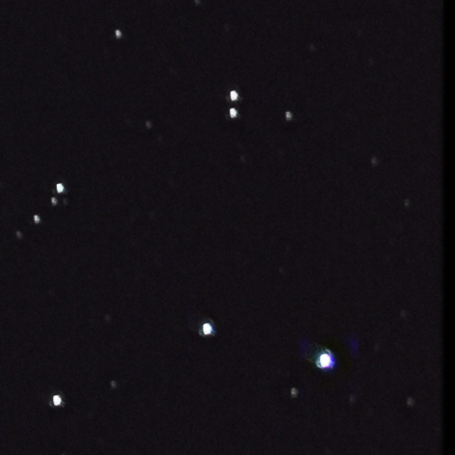

# star_stacking
Simple Astrophtography Stacking. This project is inspired by this [star tracking post](https://benedikt-bitterli.me/astro/). Unfortunately, the code in the post is in C++ (hard to modify) and not released. So this is a close implementation of the approach in post with a couple differences.

### Differences
| Original              | Mine       |
|-----------------------|-------------|
| Used Gaussian blob approach for star position  | Used an edge-based star detector - [star_finder](https://github.com/Goulustis/star-tracker)       |
| Triangular Constellation matching. This is slower than expected. Reimplementation:[match_stars.py](https://github.com/Goulustis/star_stacking/blob/main/star_align/matching/match_stars.py) | Used nearest neighbor approach     |
| focal length optimization and both rough and fine alignment + solving for extrinsics       | Handwavy used homography instead   |

## Installation
```bash
python -m pip install .
```

## How to run:
1. prepare a folder containing `.JPG` images  
2. update the `img_dir` in `run.py`
3. Finally run: `python run.py`

## Results
<table>
  <tr>
    <td align="center">
      <br>
      <i>No processing</i>
    </td>
    <td align="center">
      <br>
      <i>Light pollution removal</i>
    </td>
    <td align="center">
      <br>
      <i>Light pollution removeal + Homography</i>
    </td>
  </tr>
</table>
